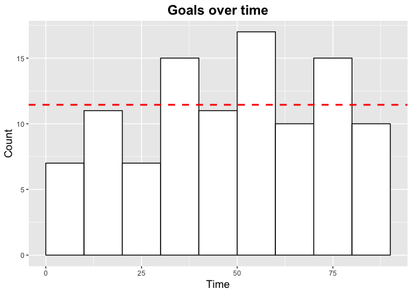
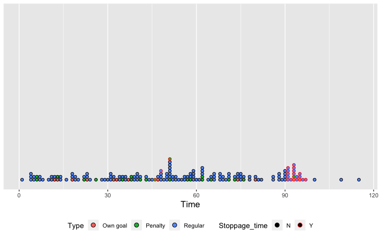
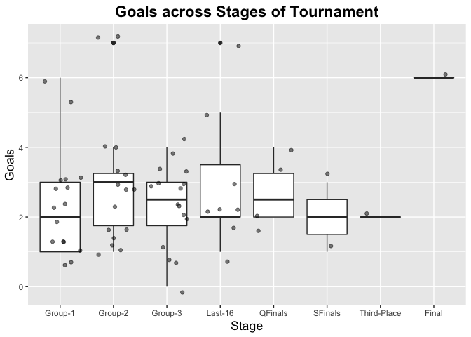
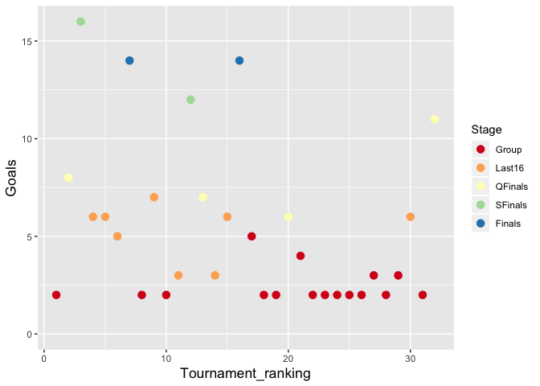
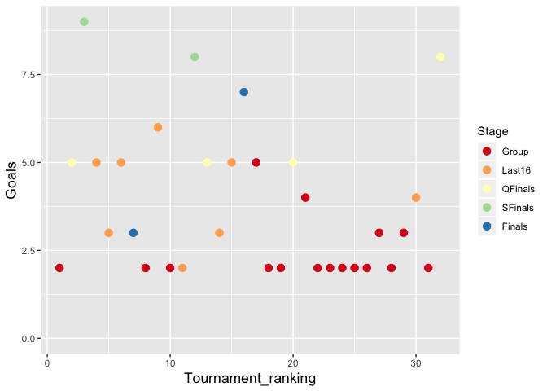

FIFA World Cup 2018-Goals
================
Kenneth Tay
7/5/2018

Introduction
------------

Goals are probably what most fans look forward to in the soccer game. This analysis takes a look at the goals scored during the FIFA World Cup 2018, and tries to identify trends in the data.

``` r
library(tidyverse)
library(knitr)
library(stringr)

# theme for plots
theme_update(plot.title = element_text(size = rel(1.5), face = "bold", hjust = 0.5),
             axis.title = element_text(size = rel(1.2)))
```

Let's load the goal data from the CSV file. Due to the way goal times are recorded in the original dataset, we add 2 new columns:

-   `Stoppage_time`: A boolean feature which is "Y" if the goal was scored in stoppage time, "N" otherwise.
-   `Time`: A numeric variable recording the time the goal was scored.

``` r
# read in data
goals_df <- read_csv("../Data/World_cup_2018_goals.csv", 
                     col_types = cols(Date = col_date(format = "%Y-%m-%d")))

# new columns due to stoppage time
stoppage <- "[0-9]+[]"
getGoalTime <- function(x) {
    time <- unlist(str_split(x, "[+]"))
    sum(as.integer(time))
}
goals_df <- goals_df %>%
    mutate(Stoppage_time = ifelse(str_detect(Time, "[+]"), "Y", "N")) %>%
    separate(Time, into = c("Time", "Extra"), sep = "[+]") %>%
    mutate(Time = ifelse(is.na(Extra), 
                         as.integer(Time), 
                         as.integer(Time) + as.integer(Extra))) %>%
    select(-Extra)

# make Stage a factor
goals_df <- goals_df %>% 
    mutate(Stage = factor(Stage, 
        levels = c("Group-1", "Group-2", "Group-3", "Last-16", 
                   "QFinals", "SFinals", "Third-Place", "Final")))
```

Here's a snippet of the goals data:

``` r
kable(head(goals_df))
```

| Date       | Stage   | Home   | Away         | Team\_scored | Player\_scored    |  Time| Own\_goal | Penalty | Stoppage\_time |
|:-----------|:--------|:-------|:-------------|:-------------|:------------------|-----:|:----------|:--------|:---------------|
| 2018-06-14 | Group-1 | Russia | Saudi Arabia | Russia       | Yury Gazinksky    |    12| N         | N       | N              |
| 2018-06-14 | Group-1 | Russia | Saudi Arabia | Russia       | Denis Cheryshev   |    43| N         | N       | N              |
| 2018-06-14 | Group-1 | Russia | Saudi Arabia | Russia       | Denis Cheryshev   |    91| N         | N       | Y              |
| 2018-06-14 | Group-1 | Russia | Saudi Arabia | Russia       | Artem Dzyuba      |    71| N         | N       | N              |
| 2018-06-14 | Group-1 | Russia | Saudi Arabia | Russia       | Aleksandr Golovin |    94| N         | N       | Y              |
| 2018-06-15 | Group-1 | Egypt  | Uruguay      | Uruguay      | Jose Gimenez      |    89| N         | N       | N              |

We also load the countries dataset as we will use some of those variables in our analysis.

``` r
country_df <- read_csv("../Data/World_cup_2018_country.csv")

country_df$Stage <- with(country_df,
    ifelse(Last16 == "N", "Group",
           ifelse(QFinals == "N", "Last16",
                  ifelse(SFinals == "N", "QFinals",
                         ifelse(Finals == "N", "SFinals", "Finals")))))
country_df$Stage <- factor(country_df$Stage, 
    levels = c("Group", "Last16", "QFinals", "SFinals", "Finals"))

kable(head(country_df))
```

| Country     |  World\_ranking|  Tournament\_ranking| Group |  Group\_score|  Group\_ranking| Last16 | QFinals | SFinals | Finals | Winner | Stage   |
|:------------|---------------:|--------------------:|:------|-------------:|---------------:|:-------|:--------|:--------|:-------|:-------|:--------|
| Germany     |               1|                    1| F     |             3|               4| N      | N       | N       | N      | N      | Group   |
| Brazil      |               2|                    2| E     |             7|               1| Y      | Y       | N       | N      | N      | QFinals |
| Belgium     |               3|                    3| G     |             9|               1| Y      | Y       | Y       | N      | N      | SFinals |
| Portugal    |               4|                    4| B     |             5|               2| Y      | N       | N       | N      | N      | Last16  |
| Argentina   |               5|                    5| D     |             4|               2| Y      | N       | N       | N      | N      | Last16  |
| Switzerland |               6|                    6| E     |             5|               2| Y      | N       | N       | N      | N      | Last16  |

Group stages
------------

First, we take a look at just the group stage matches.

``` r
group_goals <- goals_df %>% filter(Stage %in% c("Group-1", "Group-2", "Group-3"))
```

There were a total of `nrow(group_goals)` goals scored during the group stages, with roughly the same number of goals on each matchday.

``` r
group_goals %>% group_by(Stage) %>% 
    summarize(Goals = n())
```

    ## # A tibble: 3 x 2
    ##   Stage   Goals
    ##   <fct>   <int>
    ## 1 Group-1    38
    ## 2 Group-2    47
    ## 3 Group-3    37

Here are the top 5 teams in terms of goals scored in the group stage. All of them qualified for the Round of Last 16, and the top 4 qualified for the quarter-finals.

``` r
group_goals %>% group_by(Team_scored) %>%
    summarize(Goals = n()) %>%
    arrange(desc(Goals)) %>%
    head(n = 5)
```

    ## # A tibble: 5 x 2
    ##   Team_scored Goals
    ##   <chr>       <int>
    ## 1 Belgium         9
    ## 2 England         8
    ## 3 Russia          8
    ## 4 Croatia         7
    ## 5 Spain           6

The least number of goals scored in the group stages was 2, shared by 13 teams. Somewhat unsurprisingly, none of them qualified for the Round of Last 16. (It is worth noting though that Argentina, France and Mexico made it to the Round of Last 16 with just 3 goals. The team that scored the most without making it through was Tunisia with 5 goals.)

``` r
group_goals %>% group_by(Team_scored) %>%
    summarize(Goals = n()) %>%
    filter(Goals == 2)
```

    ## # A tibble: 13 x 2
    ##    Team_scored  Goals
    ##    <chr>        <int>
    ##  1 Australia        2
    ##  2 Costa Rica       2
    ##  3 Denmark          2
    ##  4 Egypt            2
    ##  5 Germany          2
    ##  6 Iceland          2
    ##  7 Iran             2
    ##  8 Morocco          2
    ##  9 Panama           2
    ## 10 Peru             2
    ## 11 Poland           2
    ## 12 Saudi Arabia     2
    ## 13 Serbia           2

Were goals scored uniformly throughout the 90 minutes? (For this section, we ignore goals scored in stoppage time.) From the histogram, it looks like fewer goals are scored in the first 30 minutes of the game, and more goals are scored in the middle of the game.

``` r
group_goals2 <- group_goals %>% filter(Stoppage_time == "N")

binwidth <- 10
ggplot(group_goals2, aes(x = Time)) +
    geom_histogram(fill = "white", col = "black", breaks = seq(0, 90, by = binwidth)) +
    geom_abline(slope = 0, intercept = nrow(group_goals2) / (90 / binwidth),
                col = "red", linetype = 2, size = 1) +
    labs(title = "Goals over time", y = "Count")
```



Overall
-------

There were a total of 169 goals scored throughout the tournament, with 12 own goals, 22 goals from penalties, and 22 goals coming in stoppage time.

Here is a plot of the goals scored over time (I couldn't figure out a way to make better use of the chart space, anyone know?):

``` r
goals_df %>% 
    mutate(Type = ifelse(Own_goal == "Y", 
                         "Own goal",
                         ifelse(Penalty == "Y", "Penalty", "Regular"))) %>%
    ggplot(aes(x = Time, col = Stoppage_time, fill = Type)) +
        geom_dotplot(binwidth = 1, stackgroups = TRUE, binpositions = "all") +
        scale_y_continuous(NULL, breaks = NULL) +
        scale_color_manual(values = c("black", "red")) +
        theme(legend.position = "bottom") 
```



Top Scorers
-----------

Here are the top 10 countries that scored the most goals overall (including own goals). Unsurprisingly, countries that made it further into the tournament scored more goals to get there, and because they made it further, they made more time to score as well.

``` r
goals_df %>% group_by(Team_scored) %>%
    summarize(Goals = n()) %>%
    arrange(desc(Goals), Team_scored) %>%
    head(n = 10)
```

    ## # A tibble: 10 x 2
    ##    Team_scored Goals
    ##    <chr>       <int>
    ##  1 Belgium        16
    ##  2 Croatia        14
    ##  3 France         14
    ##  4 England        12
    ##  5 Russia         11
    ##  6 Brazil          8
    ##  7 Spain           7
    ##  8 Uruguay         7
    ##  9 Argentina       6
    ## 10 Colombia        6

There were a total of 110 different scorers at the World Cup (excluding own goals). Here are the top 6 scorers (≥4 goals):

``` r
goals_df %>%
    filter(Own_goal == "N") %>%
    group_by(Player_scored) %>%
    summarize(Country = Team_scored[1], Goals = n()) %>%
    arrange(desc(Goals), Player_scored) %>%
    head(n = 6)
```

    ## # A tibble: 6 x 3
    ##   Player_scored     Country  Goals
    ##   <chr>             <chr>    <int>
    ## 1 Harry Kane        England      6
    ## 2 Antoine Griezmann France       4
    ## 3 Cristiano Ronaldo Portugal     4
    ## 4 Denis Cheryshev   Russia       4
    ## 5 Kylian Mbappe     France       4
    ## 6 Romelu Lukaku     Belgium      4

Here are the top 5 countries who had the most number of different players score (excluding own goals):

``` r
goals_df %>%
    filter(Own_goal == "N") %>%
    group_by(Team_scored) %>%
    summarize(Unique_players = length(unique(Player_scored))) %>%
    arrange(desc(Unique_players), Team_scored) %>%
    head(n = 5)
```

    ## # A tibble: 5 x 2
    ##   Team_scored Unique_players
    ##   <chr>                <int>
    ## 1 Belgium                 10
    ## 2 Croatia                  8
    ## 3 Brazil                   6
    ## 4 England                  6
    ## 5 France                   6

Overall
-------

Did goals get rarer as the tournament progressed? It's a bit hard to tell from the plot, but it does look like there isn't a whole lot of variation across the tournament.

``` r
goals_per_game <- goals_df %>% 
    group_by(Stage, Home, Away) %>%
    summarize(Goals = n()) %>%
    ungroup()

# add the one 0-0 game manually
goals_per_game <-add_row(goals_per_game, 
        Stage="Group-3", Home="Denmark", Away="France", Goals=0)

ggplot(goals_per_game, aes(x = Stage, y = Goals)) +
    geom_boxplot() +
    geom_jitter(alpha = 0.5) +
    labs(title = "Goals across Stages of Tournament")
```



Goals scored vs. Tournament ranking
===================================

Finally, is there a relationship between the number of goals scored and tournament ranking? This first plot shows no. of goals scored in the group stage vs. tournament ranking:

``` r
goals_by_team <- goals_df %>%
    group_by(Team_scored) %>%
    summarize(Goals = n()) %>%
    left_join(country_df, by = c("Team_scored" = "Country"))

ggplot(goals_by_team, aes(x = Tournament_ranking, y = Goals, col = Stage)) +
    geom_point(size = 3) +
    ylim(0, max(goals_by_team$Goals)) +
    scale_color_brewer(palette = "Spectral")
```



For the most part it does seem like better ranked teams scored more goals, apart from 2 outliers (Russia & Japan). What's clear is also teams that scored more went further in the tournament. Here is the same plot, but just for goals in the group stage:

``` r
goals_by_team <- goals_df %>%
    filter(Stage %in% c("Group-1", "Group-2", "Group-3")) %>%
    group_by(Team_scored) %>%
    summarize(Goals = n()) %>%
    left_join(country_df, by = c("Team_scored" = "Country"))

ggplot(goals_by_team, aes(x = Tournament_ranking, y = Goals, col = Stage)) +
    geom_point(size = 3) +
    ylim(0, max(goals_by_team$Goals)) +
    scale_color_brewer(palette = "Spectral")
```



Again, Russia is the one outlier, and it does seem that there is some stratification: teams which scored more goals in the group stage did seem to go further. One exception: France, the team which eventually won it all!
