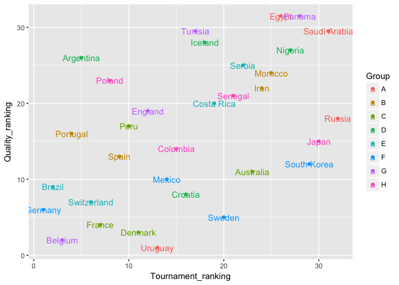
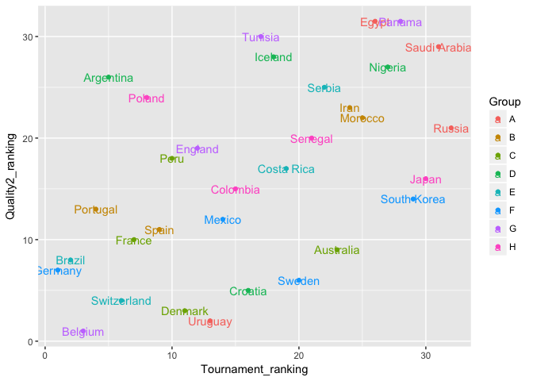
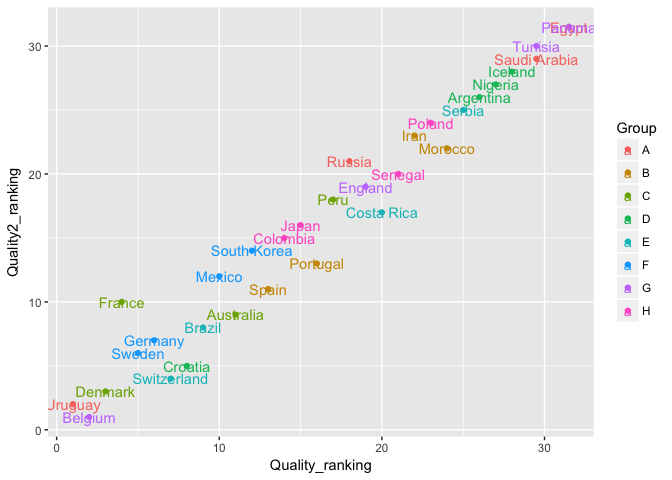

Using PageRank to Rate Teams
================
Kenneth Tay
6/30/2018

Introduction
------------

[PageRank](https://en.wikipedia.org/wiki/PageRank) is an algorithm developed by the founders of Google to rank websites in their search engine results. The basic idea is pretty simple: important pages link to important pages. Thus, we could model a page's importance as a weighted sum of the pages which are pointing to it.

Let's try to use a similar method to rank teams at the World Cup after the group stage. In the PageRank model, more important pages have the arrows pointing to them; for soccer teams, we will have better teams having arrows pointed toward them.

Coding the algorithm
--------------------

This implementation follows the exposition in Section 14.10 of *The Elements of Statistical Learning* by Hastie, Tibshirani and Friedman. The algorithm has a parameter *d* which acts as a regularization parameter. It has a specific interpretation in the random surfer view of the PageRank alogrithm: at each step of the random surfer's journey, it moves according to the edges of the graph with probability *d*, and with probability 1 − *d* it moves to a page uniformly at random.

``` r
# takes matrix L and parameter d, returns vector of pageRank scores
pageRank <- function(L, d) {
    N <- nrow(L)
    
    # if a column of L does not point to anything, we make it
    # point to itself
    for (j in 1:N) {
        if (sum(L[, j]) == 0) L[j, j] <- 1
    }
    
    D_c <- diag(colSums(L))
    e <- matrix(1, nrow = N, ncol = 1)
    A <- (1-d) * e %*% t(e) / N + d * L %*% solve(D_c)
    
    # return the first eigenvector of A (normalized to have entries sum to 1)
    p <- eigen(A)$vectors[, 1]
    as.numeric(p / sum(p))
}
```

Loading and preparing the data
------------------------------

Read in the "matches" dataset, select just the relevant columns, and add the "Tournament rank" column from the "country" dataset:

``` r
# read in data
library(tidyverse)
country_df <- read_csv("../Data/World_cup_2018_country.csv")
matches_df <- read_csv("../Data/World_cup_2018_matches.csv", 
                       col_types = cols(Date = col_date(format = "%Y-%m-%d")))

# select relevant rows
df <- matches_df %>%
    select(Home:Away_goals)

df <- df %>% 
    mutate(Home_rank = match(df$Home, country_df$Country), 
           Away_rank = match(df$Away, country_df$Country))

N <- nrow(country_df)
```

Idea 1: Construct *L* based on game result
------------------------------------------

In the original algorithm, *L*<sub>*i**j*</sub> = 1 if page *j* points to page *i* One idea is to set *L* based on solely on the game results. If *i* beats *j*, set *L*<sub>*i**j*</sub> = 1; if *j* beats *i*, set *L*<sub>*j**i*</sub> = 1; if they draw, set *L*<sub>*i**j*</sub> = *L*<sub>*j**i*</sub> = 0.5.

``` r
L <- matrix(0, nrow = N, ncol = N)
for (i in 1:nrow(df)) {
    if (df$Home_goals[i] > df$Away_goals[i]) {
        L[df$Home_rank[i], df$Away_rank[i]] <- 1
    } else if (df$Home_goals[i] < df$Away_goals[i]) {
        L[df$Away_rank[i], df$Home_rank[i]] <- 1
    } else {
        L[df$Home_rank[i], df$Away_rank[i]] <- 0.5
        L[df$Away_rank[i], df$Home_rank[i]] <- 0.5
    }
}
```

We fit the PageRank algorithm with *d* = 0.85. (I don't think the rankings change much across a range of values of *d*.)

``` r
d <- 0.85
country_df$Quality <- pageRank(L, d)
country_df$Quality_ranking <- rank(-pageRank(L, d), "min")
```

These are the ranking results:

``` r
country_df %>% arrange(Quality_ranking) %>%
    kable()
```

| Country      |  World\_ranking|  Tournament\_ranking| Group |  Group\_score|  Group\_ranking| Last16 | QFinals |    Quality|  Quality\_ranking|
|:-------------|---------------:|--------------------:|:------|-------------:|---------------:|:-------|:--------|----------:|-----------------:|
| Uruguay      |              14|                   13| A     |             9|               1| Y      | Y       |  0.1627587|               1.0|
| Belgium      |               3|                    3| G     |             9|               1| Y      | Y       |  0.1584335|               2.0|
| Denmark      |              12|                   11| C     |             5|               2| Y      | N       |  0.0926358|               3.0|
| France       |               7|                    7| C     |             7|               1| Y      | Y       |  0.0508431|               4.0|
| Sweden       |              24|                   20| F     |             6|               1| Y      | Y       |  0.0468559|               5.0|
| Germany      |               1|                    1| F     |             3|               4| N      | N       |  0.0445150|               6.0|
| Switzerland  |               6|                    6| E     |             5|               2| Y      | N       |  0.0419743|               7.0|
| Croatia      |              20|                   16| D     |             9|               1| Y      | Y       |  0.0388360|               8.0|
| Brazil       |               2|                    2| E     |             7|               1| Y      | Y       |  0.0364884|               9.0|
| Mexico       |              15|                   14| F     |             6|               2| Y      | N       |  0.0336391|              10.0|
| Australia    |              36|                   23| C     |             1|               4| N      | N       |  0.0309343|              11.0|
| South Korea  |              57|                   29| F     |             3|               3| N      | N       |  0.0236064|              12.0|
| Spain        |              10|                    9| B     |             5|               1| Y      | N       |  0.0212962|              13.0|
| Colombia     |              16|                   15| H     |             6|               1| Y      | N       |  0.0211763|              14.0|
| Japan        |              61|                   30| H     |             4|               2| Y      | N       |  0.0203976|              15.0|
| Portugal     |               4|                    4| B     |             5|               2| Y      | N       |  0.0177993|              16.0|
| Peru         |              11|                   10| C     |             3|               3| N      | N       |  0.0152052|              17.0|
| Russia       |              70|                   32| A     |             6|               2| Y      | Y       |  0.0146062|              18.0|
| England      |              13|                   12| G     |             6|               2| Y      | Y       |  0.0145722|              19.0|
| Costa Rica   |              23|                   19| E     |             1|               4| N      | N       |  0.0136070|              20.0|
| Senegal      |              27|                   21| H     |             4|               3| N      | N       |  0.0130947|              21.0|
| Iran         |              37|                   24| B     |             4|               3| N      | N       |  0.0121151|              22.0|
| Poland       |               8|                    8| H     |             3|               4| N      | N       |  0.0116227|              23.0|
| Morocco      |              41|                   25| B     |             1|               4| N      | N       |  0.0107214|              24.0|
| Serbia       |              34|                   22| E     |             3|               3| N      | N       |  0.0093139|              25.0|
| Argentina    |               5|                    5| D     |             4|               2| Y      | N       |  0.0086145|              26.0|
| Nigeria      |              48|                   27| D     |             3|               3| N      | N       |  0.0067792|              27.0|
| Iceland      |              22|                   18| D     |             1|               4| N      | N       |  0.0061520|              28.0|
| Tunisia      |              21|                   17| G     |             3|               3| N      | N       |  0.0060156|              29.5|
| Saudi Arabia |              67|                   31| A     |             3|               3| N      | N       |  0.0060156|              29.5|
| Egypt        |              45|                   26| A     |             0|               4| N      | N       |  0.0046875|              31.5|
| Panama       |              55|                   28| G     |             0|               4| N      | N       |  0.0046875|              31.5|

Let's plot the new ranking vs. the original ranking before the tournament started:

``` r
ggplot(country_df, 
       aes(x = Tournament_ranking, y = Quality_ranking, label = Country, col = Group)) +
    geom_point() +
    geom_text()
```



Idea 2: Construct *L* based on goal difference
----------------------------------------------

In the previous idea, every win is given equal weight. We could potentially improve on that by taking goal difference into account. In this idea, If *i* beats *j*, set *L*<sub>*i**j*</sub> = *g**o**a**l*<sub>*i*</sub> − *g**o**a**l*<sub>*j*</sub> + 0.5; if *j* beats *i*, set *L*<sub>*j**i*</sub> = *g**o**a**l*<sub>*j*</sub> − *g**o**a**l*<sub>*i*</sub> + 0.5; if they draw, set *L*<sub>*i**j*</sub> = *L*<sub>*j**i*</sub> = *g**o**a**l*<sub>*i*</sub> + 0.5. (We add 0.5 so that a 0-0 draw doesn't have the same effect as no match played.)

``` r
L <- matrix(0, nrow = N, ncol = N)
for (i in 1:nrow(df)) {
    if (df$Home_goals[i] > df$Away_goals[i]) {
        L[df$Home_rank[i], df$Away_rank[i]] <- df$Home_goals[i] - df$Away_goals[i] + 0.5
    } else if (df$Home_goals[i] < df$Away_goals[i]) {
        L[df$Away_rank[i], df$Home_rank[i]] <- df$Away_goals[i] - df$Home_goals[i] + 0.5
    } else {
        L[df$Home_rank[i], df$Away_rank[i]] <- df$Home_goals[i] + 0.5
        L[df$Away_rank[i], df$Home_rank[i]] <- df$Away_goals[i] + 0.5
    }
}
```

We fit the PageRank algorithm with this new *L*, again with *d* = 0.85:

``` r
country_df$Quality2 <- pageRank(L, d)
country_df$Quality2_ranking <- rank(-pageRank(L, d), "min")
```

These are the ranking results:

``` r
country_df %>% arrange(Quality2_ranking) %>%
    kable()
```

| Country      |  World\_ranking|  Tournament\_ranking| Group |  Group\_score|  Group\_ranking| Last16 | QFinals |    Quality|  Quality\_ranking|   Quality2|  Quality2\_ranking|
|:-------------|---------------:|--------------------:|:------|-------------:|---------------:|:-------|:--------|----------:|-----------------:|----------:|------------------:|
| Belgium      |               3|                    3| G     |             9|               1| Y      | Y       |  0.1584335|               2.0|  0.1485112|                1.0|
| Uruguay      |              14|                   13| A     |             9|               1| Y      | Y       |  0.1627587|               1.0|  0.1409662|                2.0|
| Denmark      |              12|                   11| C     |             5|               2| Y      | N       |  0.0926358|               3.0|  0.0903520|                3.0|
| Switzerland  |               6|                    6| E     |             5|               2| Y      | N       |  0.0419743|               7.0|  0.0474017|                4.0|
| Croatia      |              20|                   16| D     |             9|               1| Y      | Y       |  0.0388360|               8.0|  0.0467230|                5.0|
| Sweden       |              24|                   20| F     |             6|               1| Y      | Y       |  0.0468559|               5.0|  0.0402777|                6.0|
| Germany      |               1|                    1| F     |             3|               4| N      | N       |  0.0445150|               6.0|  0.0389236|                7.0|
| Brazil       |               2|                    2| E     |             7|               1| Y      | Y       |  0.0364884|               9.0|  0.0379554|                8.0|
| Australia    |              36|                   23| C     |             1|               4| N      | N       |  0.0309343|              11.0|  0.0376015|                9.0|
| France       |               7|                    7| C     |             7|               1| Y      | Y       |  0.0508431|               4.0|  0.0341961|               10.0|
| Spain        |              10|                    9| B     |             5|               1| Y      | N       |  0.0212962|              13.0|  0.0310445|               11.0|
| Mexico       |              15|                   14| F     |             6|               2| Y      | N       |  0.0336391|              10.0|  0.0278748|               12.0|
| Portugal     |               4|                    4| B     |             5|               2| Y      | N       |  0.0177993|              16.0|  0.0255807|               13.0|
| South Korea  |              57|                   29| F     |             3|               3| N      | N       |  0.0236064|              12.0|  0.0253656|               14.0|
| Colombia     |              16|                   15| H     |             6|               1| Y      | N       |  0.0211763|              14.0|  0.0236098|               15.0|
| Japan        |              61|                   30| H     |             4|               2| Y      | N       |  0.0203976|              15.0|  0.0233800|               16.0|
| Costa Rica   |              23|                   19| E     |             1|               4| N      | N       |  0.0136070|              20.0|  0.0230018|               17.0|
| Peru         |              11|                   10| C     |             3|               3| N      | N       |  0.0152052|              17.0|  0.0192153|               18.0|
| England      |              13|                   12| G     |             6|               2| Y      | Y       |  0.0145722|              19.0|  0.0181492|               19.0|
| Senegal      |              27|                   21| H     |             4|               3| N      | N       |  0.0130947|              21.0|  0.0162981|               20.0|
| Russia       |              70|                   32| A     |             6|               2| Y      | Y       |  0.0146062|              18.0|  0.0156325|               21.0|
| Morocco      |              41|                   25| B     |             1|               4| N      | N       |  0.0107214|              24.0|  0.0134835|               22.0|
| Iran         |              37|                   24| B     |             4|               3| N      | N       |  0.0121151|              22.0|  0.0128310|               23.0|
| Poland       |               8|                    8| H     |             3|               4| N      | N       |  0.0116227|              23.0|  0.0101074|               24.0|
| Serbia       |              34|                   22| E     |             3|               3| N      | N       |  0.0093139|              25.0|  0.0091994|               25.0|
| Argentina    |               5|                    5| D     |             4|               2| Y      | N       |  0.0086145|              26.0|  0.0084327|               26.0|
| Nigeria      |              48|                   27| D     |             3|               3| N      | N       |  0.0067792|              27.0|  0.0071377|               27.0|
| Iceland      |              22|                   18| D     |             1|               4| N      | N       |  0.0061520|              28.0|  0.0063416|               28.0|
| Saudi Arabia |              67|                   31| A     |             3|               3| N      | N       |  0.0060156|              29.5|  0.0057741|               29.0|
| Tunisia      |              21|                   17| G     |             3|               3| N      | N       |  0.0060156|              29.5|  0.0052567|               30.0|
| Egypt        |              45|                   26| A     |             0|               4| N      | N       |  0.0046875|              31.5|  0.0046875|               31.5|
| Panama       |              55|                   28| G     |             0|               4| N      | N       |  0.0046875|              31.5|  0.0046875|               31.5|

Plot of the new ranking vs. the original ranking before the tournament started:

``` r
ggplot(country_df, 
       aes(x = Tournament_ranking, y = Quality2_ranking, label = Country, col = Group)) +
    geom_point() +
    geom_text()
```



Plot of ranking due to idea 2 vs. ranking due to idea 1 is below. The 2 rankings agree a fair amount with each other.

``` r
ggplot(country_df, 
       aes(x = Quality_ranking, y = Quality2_ranking, label = Country, col = Group)) +
    geom_point() +
    geom_text()
```



Discussion
----------

Do the rankings seem reasonable? For some groups, the rankings match the standing based on total score (e.g. Group A). On the other hand, some teams that topped their group (e.g. Brazil, France) did not top their group in the new rankings.

There is a big question mark over the rankings across groups, since teams only play within groups. The only way we transmit information across groups here is via visiting a team uniformly at random with probability *d*.

We are also not using any prior information we have from the rankings before the tournament. One way to incorporate this is what happens when we visit a team randomly with probability *d*. Instead of moving to a team uniformly at random, we can tweak the probabilities so that we visit stronger teams with higher probability.
