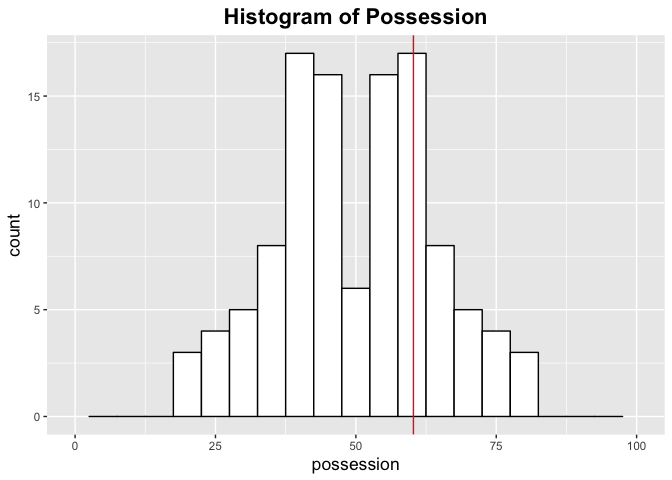
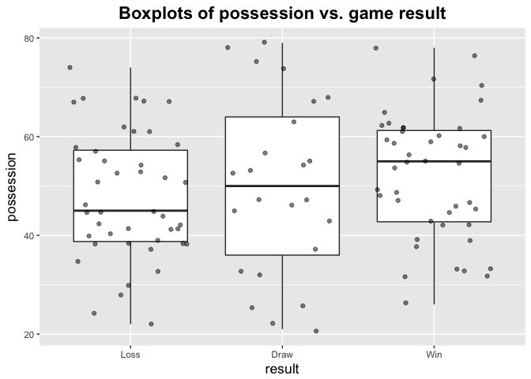
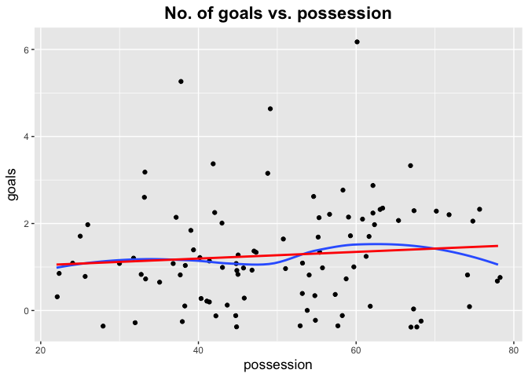
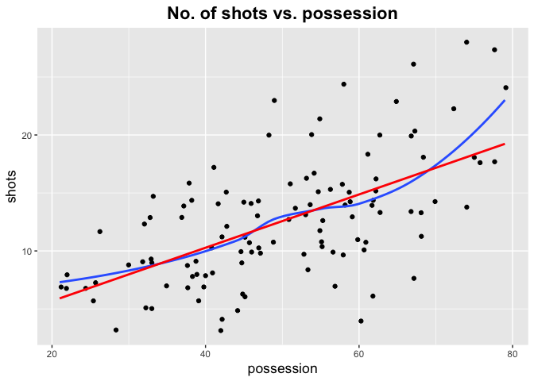
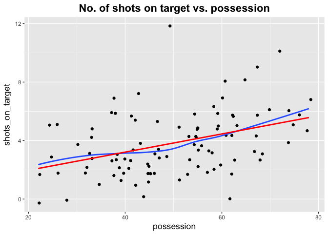
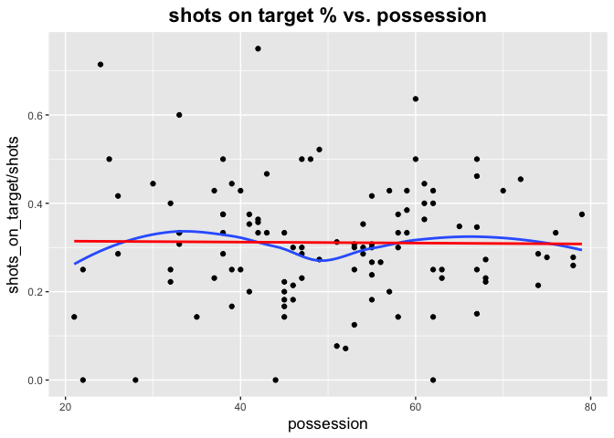
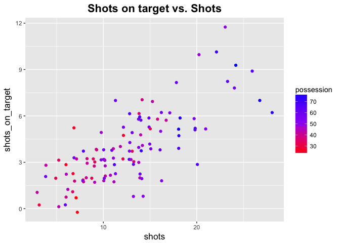

FIFA World Cup 2018-Possession
================
Kenneth Tay
6/29/2018

Introduction
------------

At first glance, it would seem that having more possession of the ball should give a team a better result. Is this borne out in the world cup data?

``` r
library(tidyverse)
library(knitr)

# theme for plots
theme_update(plot.title = element_text(size = rel(1.5), face = "bold", hjust = 0.5),
             axis.title = element_text(size = rel(1.2)))
```

Match and goals data was compiled from Google answer boxes, which seems to take data from foxsports.com. Rankings are as of 2018-06-07, and were taken from <https://www.fifa.com/fifa-world-ranking/ranking-table/men/index.html>. Data is available at <https://github.com/kjytay/FIFA-world-cup-2018>.

Load data:

``` r
country_df <- read_csv("../Data/World_cup_2018_country.csv")
matches_df <- read_csv("../Data/World_cup_2018_matches.csv", 
    col_types = cols(Date = col_date(format = "%Y-%m-%d")))
goals_df <- read_csv("../Data/World_cup_2018_goals.csv", 
    col_types = cols(Date = col_date(format = "%Y-%m-%d")))
```

Preview of the 3 datasets:

``` r
kable(head(country_df))
```

| Country     |  World\_ranking|  Tournament\_ranking| Group |  Group\_score|  Group\_ranking| Last16 | QFinals |
|:------------|---------------:|--------------------:|:------|-------------:|---------------:|:-------|:--------|
| Germany     |               1|                    1| F     |             3|               4| N      | N       |
| Brazil      |               2|                    2| E     |             7|               1| Y      | Y       |
| Belgium     |               3|                    3| G     |             9|               1| Y      | Y       |
| Portugal    |               4|                    4| B     |             5|               2| Y      | N       |
| Argentina   |               5|                    5| D     |             4|               2| Y      | N       |
| Switzerland |               6|                    6| E     |             5|               2| Y      | N       |

``` r
kable(head(matches_df))
```

| Date       | Stage   | Home      | Away         |  Home\_goals|  Away\_goals|  Home\_shots|  Home\_shots\_on\_target|  Home\_possession|  Home\_fouls|  Home\_yellow|  Home\_red|  Home\_offsides|  Home\_corners|  Away\_shots|  Away\_shots\_on\_target|  Away\_possession|  Away\_fouls|  Away\_yellow|  Away\_red|  Away\_offsides|  Away\_corners| Extra\_time |  Home\_extra\_goals|  Away\_extra\_goals| Penalties |  Home\_PK\_taken|  Home\_PK\_made|  Away\_PK\_taken|  Away\_PK\_made|
|:-----------|:--------|:----------|:-------------|------------:|------------:|------------:|------------------------:|-----------------:|------------:|-------------:|----------:|---------------:|--------------:|------------:|------------------------:|-----------------:|------------:|-------------:|----------:|---------------:|--------------:|:------------|-------------------:|-------------------:|:----------|----------------:|---------------:|----------------:|---------------:|
| 2018-06-14 | Group-1 | Russia    | Saudi Arabia |            5|            0|           14|                        7|                38|           22|             1|          0|               3|              6|            6|                        0|                62|           10|             1|          0|               1|              2| NA          |                  NA|                  NA| NA        |               NA|              NA|               NA|              NA|
| 2018-06-15 | Group-1 | Egypt     | Uruguay      |            0|            1|            8|                        3|                41|           12|             2|          0|               1|              0|           15|                        5|                59|            6|             0|          0|               1|              5| NA          |                  NA|                  NA| NA        |               NA|              NA|               NA|              NA|
| 2018-06-15 | Group-1 | Morocco   | Iran         |            0|            1|           13|                        3|                68|           22|             1|          0|               0|              5|            9|                        2|                32|           14|             3|          0|               0|              2| NA          |                  NA|                  NA| NA        |               NA|              NA|               NA|              NA|
| 2018-06-15 | Group-1 | Portugal  | Spain        |            3|            3|            9|                        3|                33|           12|             1|          0|               1|              4|           13|                        6|                67|           10|             1|          0|               3|              5| NA          |                  NA|                  NA| NA        |               NA|              NA|               NA|              NA|
| 2018-06-16 | Group-1 | France    | Australia    |            2|            1|           12|                        5|                55|           16|             1|          0|               0|              5|            6|                        1|                45|           19|             3|          0|               0|              1| NA          |                  NA|                  NA| NA        |               NA|              NA|               NA|              NA|
| 2018-06-16 | Group-1 | Argentina | Iceland      |            1|            1|           27|                        7|                78|           10|             0|          0|               0|             10|            8|                        2|                22|           15|             0|          0|               0|              2| NA          |                  NA|                  NA| NA        |               NA|              NA|               NA|              NA|

``` r
kable(head(goals_df))
```

| Date       | Stage   | Home   | Away         | Team\_scored | Player\_scored    | Time | Own\_goal | Penalty |
|:-----------|:--------|:-------|:-------------|:-------------|:------------------|:-----|:----------|:--------|
| 2018-06-14 | Group-1 | Russia | Saudi Arabia | Russia       | Yury Gazinksky    | 12   | N         | N       |
| 2018-06-14 | Group-1 | Russia | Saudi Arabia | Russia       | Denis Cheryshev   | 43   | N         | N       |
| 2018-06-14 | Group-1 | Russia | Saudi Arabia | Russia       | Denis Cheryshev   | 90+1 | N         | N       |
| 2018-06-14 | Group-1 | Russia | Saudi Arabia | Russia       | Artem Dzyuba      | 71   | N         | N       |
| 2018-06-14 | Group-1 | Russia | Saudi Arabia | Russia       | Aleksandr Golovin | 90+4 | N         | N       |
| 2018-06-15 | Group-1 | Egypt  | Uruguay      | Uruguay      | Jose Gimenez      | 89   | N         | N       |

Let's add columns to the matches dataset which indicate the result for the teams:

``` r
matches_df <- matches_df %>% 
    mutate(Home_result = ifelse(Home_goals > Away_goals, "Win", 
                                ifelse(Home_goals < Away_goals, "Loss", "Draw")),
           Away_result = ifelse(Home_result == "Win", "Loss",
                                ifelse(Home_result == "Loss", "Win", "Draw")))
```

Home and away don't mean anything at the World Cup, so let's reshape the dataset such that each row represents the statistics for 1 team in 1 game. Let's also make the "result" column an ordinal variable.

``` r
home_df <- matches_df %>% select(Home, Home_result, Home_goals, Home_shots:Home_corners)
away_df <- matches_df %>% select(Away, Away_result, Away_goals, Away_shots:Away_corners)
colnames <- c("country", "result", "goals", "shots", "shots_on_target", 
              "possession", "fouls", "yellow", "red", "offsides", "corners")
names(home_df) <- colnames; names(away_df) <- colnames
matches_team_df <- rbind(home_df, away_df)
matches_team_df$result <- ordered(matches_team_df$result, levels = c("Loss", "Draw", "Win"))
```

Summary statistics
------------------

Let's get a feel for how much possession a team has in a game. The maximum possession % a team had was 79% (Spain in Spain vs. Iran and Argentina in Argentina vs. Iceland). The mean possession % for teams that had majority of the possession in the game was 61.75%.

``` r
sorted_possession <- sort(matches_team_df$possession)
mean(sorted_possession[(nrow(matches_df) + 1):(2 * nrow(matches_df))])
```

    ## [1] 61.71429

Below is a histogram of possession % for all teams in all matches. As expected, the histogram is symmetric about 50%, since the 2 teams playing each other have possession adding up to 100%. Looking at just the teams with majority of the possession, the median percentage is 60.25%, indicated by the vertical red line.

``` r
quantile(sort(matches_team_df$possession), 0.75)
```

    ##   75% 
    ## 60.25

``` r
ggplot(matches_team_df, aes(x = possession)) +
    geom_histogram(fill = "white", col = "black", binwidth = 5) + xlim(c(0, 100)) +
    geom_vline(xintercept = quantile(sort(matches_team_df$possession), 0.75), 
               col = "red") +
    labs(title = "Histogram of Possession")
```



The table below shows the top 10 teams which had the most possession across their group games:

``` r
matches_team_df %>% 
    group_by(country) %>%
    summarize(mean_possession = mean(possession)) %>%
    arrange(desc(mean_possession)) %>%
    head(n = 10)
```

    ## # A tibble: 10 x 2
    ##    country      mean_possession
    ##    <chr>                  <dbl>
    ##  1 Spain                   74.8
    ##  2 Germany                 72.3
    ##  3 Argentina               66  
    ##  4 Saudi Arabia            60  
    ##  5 Switzerland             59.8
    ##  6 Brazil                  58.5
    ##  7 Belgium                 55.8
    ##  8 England                 55  
    ##  9 Portugal                54.8
    ## 10 Japan                   54

I was a little surprised to see Saudi Arabia in the top 5. It turns out that they had the lion's share of possession against Russia even though they lost 5-0. Out of these 10 countries, only Germany(2) and Saudi Arabia(5) did not advance to the knockout stages.

Possession and winning
----------------------

Does having more possession usually lead to a win? Below, we make boxplots of possession for each game outcome. The boxplots seem to indicate that having more possession leads to better results, although it's pretty hard to tell from the raw data. We could do ordinal logistic regression to quantify the effect of possession on the game result.

``` r
ggplot(matches_team_df, aes(x = result, y = possession)) +
    geom_boxplot() +
    geom_jitter(alpha = 0.5) + 
    labs(title = "Boxplots of possession vs. game result")
```



Next, let's look at how possession is related to other positive outcomes in the game. Below is a scatterplot of goals vs. possession, with the red line being the linear regression fit and blue line being the LOESS smoother.

``` r
ggplot(matches_team_df, aes(x = possession, y = goals)) +
    geom_jitter() +
    geom_smooth(se = FALSE) +
    geom_smooth(method = lm, se = FALSE, col = "red") +
    labs(title = "No. of goals vs. possession")
```

    ## `geom_smooth()` using method = 'loess'



The regression fits are remarkably flat, suggesting that possession doesn't have much to do with the number of goals scored. The *p*-value on the linear regression slope is 0.38.

``` r
summary(lm(goals ~ possession, data = matches_team_df))
```

    ## 
    ## Call:
    ## lm(formula = goals ~ possession, data = matches_team_df)
    ## 
    ## Residuals:
    ##     Min      1Q  Median      3Q     Max 
    ## -1.4127 -1.1830 -0.2604  0.6555  4.6509 
    ## 
    ## Coefficients:
    ##             Estimate Std. Error t value Pr(>|t|)  
    ## (Intercept) 1.076132   0.412549   2.608   0.0104 *
    ## possession  0.004549   0.007948   0.572   0.5683  
    ## ---
    ## Signif. codes:  0 '***' 0.001 '**' 0.01 '*' 0.05 '.' 0.1 ' ' 1
    ## 
    ## Residual standard error: 1.173 on 110 degrees of freedom
    ## Multiple R-squared:  0.002969,   Adjusted R-squared:  -0.006095 
    ## F-statistic: 0.3276 on 1 and 110 DF,  p-value: 0.5683

Below is a scatterplot of goals vs. possession. There is a clear positive correlation here, and the linear fit isn't too bad.

``` r
ggplot(matches_team_df, aes(x = possession, y = shots)) +
    geom_jitter() +
    geom_smooth(se = FALSE) +
    geom_smooth(method = lm, se = FALSE, col = "red") +
    labs(title = "No. of shots vs. possession")
```

    ## `geom_smooth()` using method = 'loess'



More possession often goes hand-in-hand with more shots, which is something one would expect.

``` r
summary(lm(shots ~ possession, data = matches_team_df))
```

    ## 
    ## Call:
    ## lm(formula = shots ~ possession, data = matches_team_df)
    ## 
    ## Residuals:
    ##      Min       1Q   Median       3Q      Max 
    ## -10.8693  -2.7438  -0.3693   2.7797  10.6584 
    ## 
    ## Coefficients:
    ##             Estimate Std. Error t value Pr(>|t|)    
    ## (Intercept)  1.08227    1.49739   0.723    0.471    
    ## possession   0.22978    0.02885   7.965 1.64e-12 ***
    ## ---
    ## Signif. codes:  0 '***' 0.001 '**' 0.01 '*' 0.05 '.' 0.1 ' ' 1
    ## 
    ## Residual standard error: 4.256 on 110 degrees of freedom
    ## Multiple R-squared:  0.3658, Adjusted R-squared:   0.36 
    ## F-statistic: 63.45 on 1 and 110 DF,  p-value: 1.639e-12

Let's look next at shots on goal vs. possession. There still is a positive correlation but the slope of the linear fit is markedly flatter. (*p*-value on the linear fit slope is still very small.)

``` r
ggplot(matches_team_df, aes(x = possession, y = shots_on_target)) +
    geom_jitter() +
    geom_smooth(se = FALSE) +
    geom_smooth(method = lm, se = FALSE, col = "red") +
    labs(title = "No. of shots on target vs. possession")
```

    ## `geom_smooth()` using method = 'loess'



``` r
summary(lm(shots_on_target ~ possession, data = matches_team_df))
```

    ## 
    ## Call:
    ## lm(formula = shots_on_target ~ possession, data = matches_team_df)
    ## 
    ## Residuals:
    ##     Min      1Q  Median      3Q     Max 
    ## -4.7191 -1.4691 -0.2531  1.0635  8.1470 
    ## 
    ## Coefficients:
    ##             Estimate Std. Error t value Pr(>|t|)    
    ## (Intercept)  0.58845    0.73013   0.806    0.422    
    ## possession   0.06662    0.01407   4.736 6.53e-06 ***
    ## ---
    ## Signif. codes:  0 '***' 0.001 '**' 0.01 '*' 0.05 '.' 0.1 ' ' 1
    ## 
    ## Residual standard error: 2.075 on 110 degrees of freedom
    ## Multiple R-squared:  0.1694, Adjusted R-squared:  0.1618 
    ## F-statistic: 22.43 on 1 and 110 DF,  p-value: 6.532e-06

We conclude that having more possession usually means more shots and more shots on target. Can we say whether having more possession leads to better quality shots? More specifically, does having more possession lead to a higher percentage of shots being on target?

``` r
ggplot(matches_team_df, 
       aes(x = possession, y = shots_on_target / shots)) +
    geom_point() + 
    geom_smooth(se = FALSE) +
    geom_smooth(method = lm, se = FALSE, col = "red") + 
    labs(title = "shots on target % vs. possession")
```

    ## `geom_smooth()` using method = 'loess'



Interestingly the percentage of shots being on target seems to have almost no correlation with possession.

``` r
summary(lm(shots_on_target / shots ~ possession, data = matches_team_df))
```

    ## 
    ## Call:
    ## lm(formula = shots_on_target/shots ~ possession, data = matches_team_df)
    ## 
    ## Residuals:
    ##      Min       1Q   Median       3Q      Max 
    ## -0.31420 -0.07943 -0.01047  0.07754  0.43796 
    ## 
    ## Coefficients:
    ##               Estimate Std. Error t value Pr(>|t|)    
    ## (Intercept)  0.3165823  0.0479900   6.597 1.52e-09 ***
    ## possession  -0.0001082  0.0009245  -0.117    0.907    
    ## ---
    ## Signif. codes:  0 '***' 0.001 '**' 0.01 '*' 0.05 '.' 0.1 ' ' 1
    ## 
    ## Residual standard error: 0.1364 on 110 degrees of freedom
    ## Multiple R-squared:  0.0001246,  Adjusted R-squared:  -0.008965 
    ## F-statistic: 0.01371 on 1 and 110 DF,  p-value: 0.907

We can also see that somewhat from the plot below. If possession led to better quality shots, then the points at the bottom of the cluster would tend to be red while the points at the top would tend to be blue. We don't see that trend: rather, the points on the left tend to be red while the points on the right tend to be blue, regardless of height.

``` r
ggplot(matches_team_df, aes(x = shots, y = shots_on_target, col = possession)) +
    geom_jitter(height = 0.3, width = 0.3) +
    scale_color_gradient2(high = "blue", low = "red", mid = "purple", midpoint = 50) +
    labs(title = "Shots on target vs. Shots")
```


